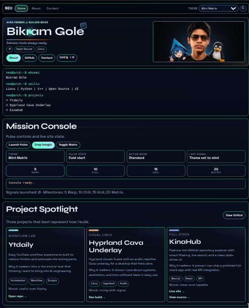

# Bikram Gole - The Aura Website

Welcome to my personal website 👋, a unique digital space blending cosmic aesthetics, hacker ethos, and controlled dynamism. This site is intentionally dramatic, reflecting my distinctive personal brand.



**Live Site:** `https://devxtechnic.github.io/`

## Motivation

I conceived this project to create a personal website that authentically represents my identity and technical prowess. My key objectives included:

-   **Distinctive Design:** A dark, interactive, and engaging user experience.
-   **Personal Expression:** A platform that feels personal rather than corporate.
-   **Memorable Experience:** Designed to be unique and leave a lasting impression on visitors.
-   **Technical Sophistication:** Showcasing technical skills in a way that resonates with fellow developers.

## Key Features

My website incorporates a variety of interactive and engaging features: ✨

-   **Multi-Page Navigation:** Seamless navigation across `Home`, `About`, and `Contact` sections.
-   **Dynamic Theme Engine:** A robust theme system offering multiple visual styles, including `Liquid Glass` and `Black Flag Uprising`, with theme persistence across page transitions.
-   **Interactive Mini Terminal:** A functional command-line interface for enhanced user engagement.
-   **Persona Quiz Game:** An integrated game designed to interactively explore user personas.
-   **Live GitHub Repository Cards:** Displays real-time project information fetched from `github.com/DevXtechnic` via the GitHub API.
-   **Engaging UI/UX:** Features such as easter eggs, pulse effects, and other dynamic interactions to create a vibrant user experience.

## Technology Stack

I leveraged a modern web development stack to deliver this project's rich features:

-   **HTML:** For structuring the web content.
-   **CSS:** For styling and implementing the diverse theme engine.
-   **Vanilla JavaScript:** Powers all interactive elements, terminal logic, quiz functionality, and dynamic effects.
-   **GitHub Pages:** Utilized for reliable and free hosting of my static site.
-   **GitHub API:** Used to dynamically fetch and display my repository data.

## Project Structure

The repository is organized as follows: 📁

-   `index.html`: My main landing page.
-   `about.html`: Contains my lore, identity, and interests.
-   `contact.html`: Provides direct channels to contact me.
-   `styles.css`: Centralized stylesheet for all themes and UI styling.
-   `script.js`: Contains all my JavaScript logic for interactions, terminal, quiz, and visual effects.

## Getting Started (Run Locally)

To set up and run my project on your local machine, follow these steps 👇:

1.  **Clone the repository:**
    ```bash
    git clone https://github.com/DevXtechnic/DevXtechnic.github.io.git
    cd DevXtechnic.github.io
    ```
2.  **Serve the files:**
    You can use a simple Python HTTP server 🐍:
    ```bash
    python -m http.server 8000
    ```
3.  **Access the site:**
    Open your web browser and navigate to `http://localhost:8000`. 🚀

## Developer Notes

-   I included a `.nojekyll` file to ensure GitHub Pages serves files directly, bypassing Jekyll processing.
-   I manage theme state with URL `theme` parameters and `localStorage`, with explicit URL themes taking precedence.
-   I intentionally included over-engineered elements for demonstrative and exploratory purposes, reflecting my commitment to creative and technical experimentation. No regrets!

## Contributing

Contributions are welcome! If you have suggestions for improvements or new features, please open an issue or submit a pull request.

## License

This project is unlicensed. Feel free to use, modify, and distribute it as you wish. 🔓
